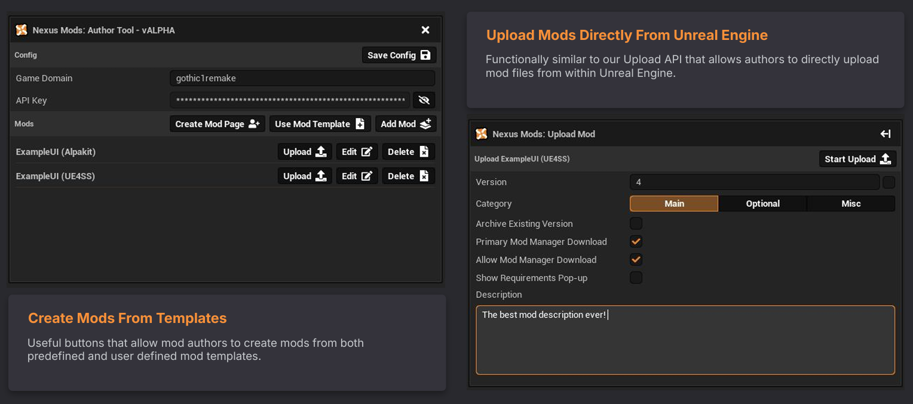

# Nexus Mods: Unreal Engine Author Tools

    

<!--  -->

## Overview

Nexus Mods Author Tools is an open-source Unreal Engine plugin designed to simplify the process of creating, managing, packaging, and publishing game mods to Nexus Mods. The aim is to reduce the technical barriers involved in creating Unreal Engine game mods by providing a consistent, integrated workflow directly within the Unreal Editor. 

Rather than requiring authors to switch between multiple external tools, the plugin integrates common mod development workflows directly into the Unreal Editor, helping both new and experienced creators spend less time on project setup and more time building content. 

The plugin currently supports the Unreal Engine versions 4.26 → 5.8. Support for additional engine versions may be added in future releases.

---

## Features
- Native Unreal Editor integration
- Integrated Nexus Mods upload support
- Built-in mod template management
- Mod archive creation prior to upload
- Cross-version support for Unreal Engine 4 and 5
- Extensible framework for future authoring tools

Planned areas of development include:
- Markdown rendering for in-editor help, documentation and release notes
- Additional modding workflows and project templates
- Improved validation and diagnostics
- Expanded editor utilities
- Improved documentation

---

## Documentation
- [Basic Install](/Docs/Installing.md)
- [Common Issues](/Docs/Troubleshooting.md)
- [Building From Source](/Docs/Building.md)
- [Release Tools](/Docs/Releasing.md)

# Contributing

Contributions are welcome.

If you would like to contribute:

- Report bugs through GitHub Issues.
- Suggest new features or improvements.
- Submit Pull Requests.
- Follow the existing project architecture and coding style.

Please keep contributions focused, well documented, and consistent with the project's overall design.

---

# License

This project is licensed under the terms described in the accompanying [LICENSE](LICENSE) file.

While contributions are welcome, the project is intended to support the Nexus Mods ecosystem and may not be used to develop competing commercial mod distribution services as described in the license.

---

# Third-Party Libraries / Resources

This project includes the following third-party libraries and assets:

| Library/Resource | Purpose | License |
|---------|---------|---------|
| [**FontAwesome**](https://fontawesome.com) | User interface icons | CC BY 4.0 |
| [**miniz**](https://github.com/richgel999/miniz) | ZIP archive creation and extraction | MIT / Public Domain |

---

# Disclaimer

Nexus Mods Author Tools is developed by Nexus Mods to improve the Unreal Engine mod authoring experience.

This project is not affiliated with or endorsed by Epic Games.

Unreal Engine is a trademark or registered trademark of Epic Games, Inc.